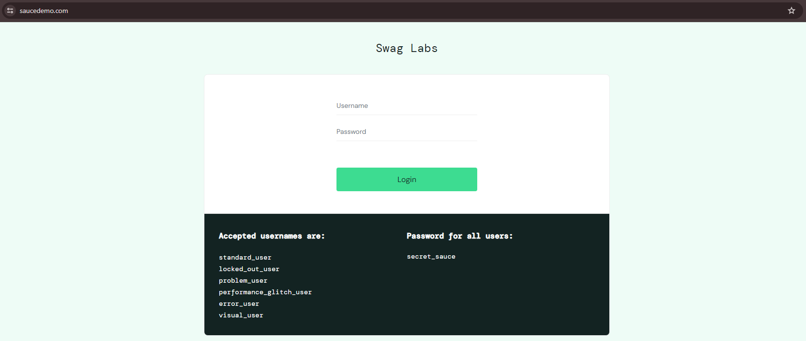
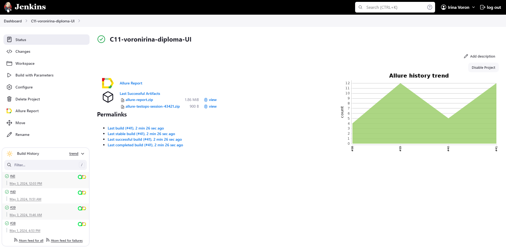
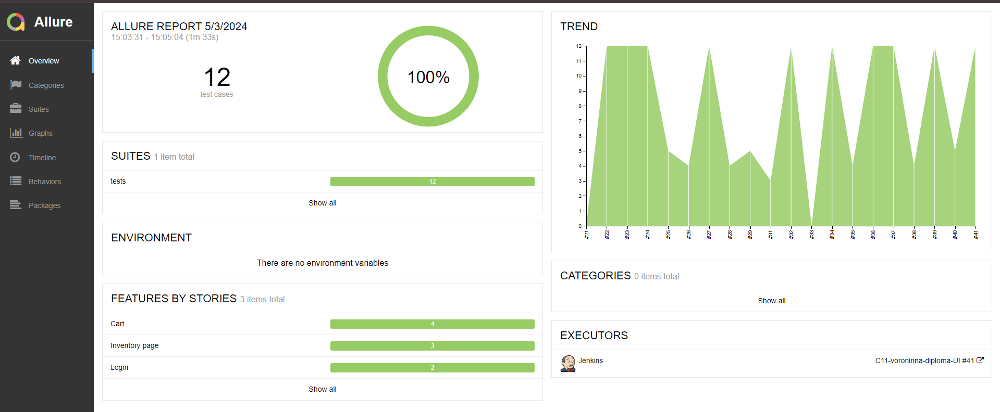
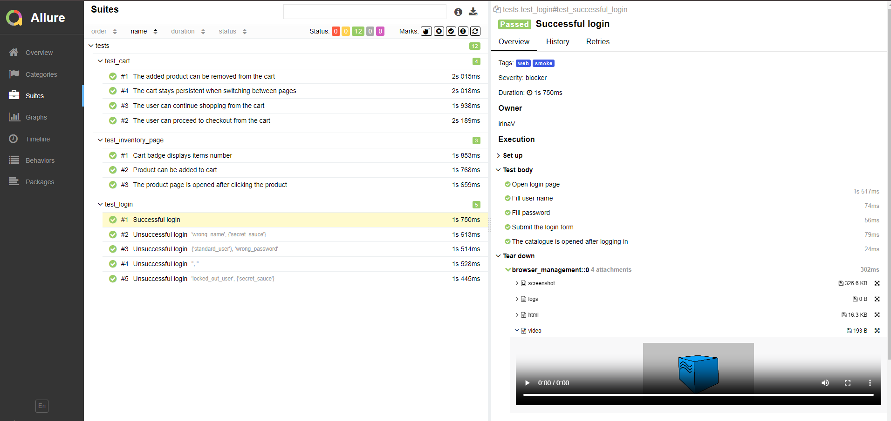
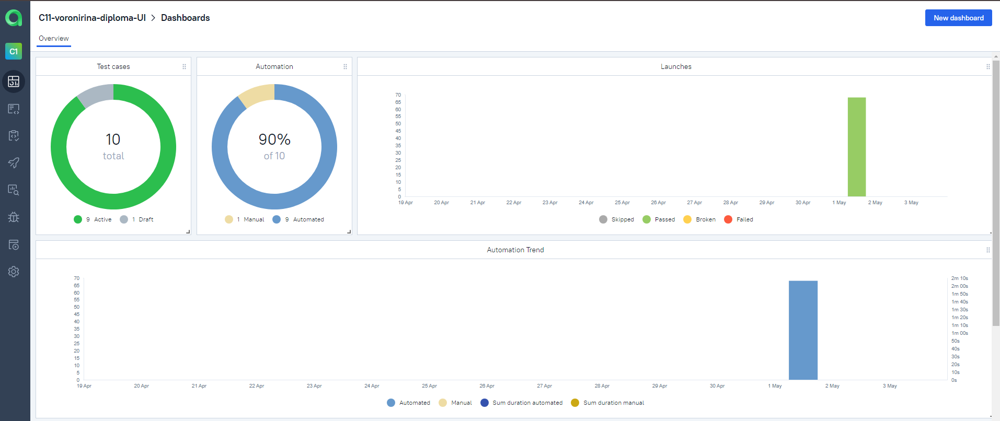
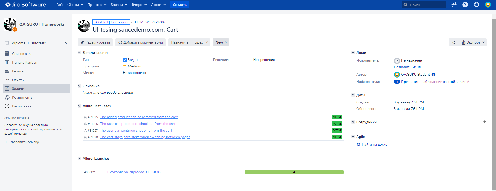
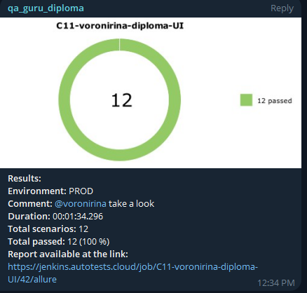

# <p align="center"> UI tests automation project Swag Labs </p>
### <p align="center"> in <code>Python</code> using <code>Pytest</code> </p>
<p align="center">

</p>

##  Content

> ➠ [Technology Stack](#technology-stack)
>
> ➠ [Covered Functionality](#covered-functionality)
>
> ➠ [Build in Jenkins](#running-tests-remotely-on-jenkins)
>
> ➠ [Allure Report](#overview)
> 
> ➠ [Report in TestOps](#dashboard)
> 
> ➠ [Integration with Jira](#test-caseslaunches-in-testops-are-integrated-with-tasks-in-jira)
>
> ➠ [Notifications in Telegram](#after-the-test-run-is-completed-a-special-bot-created-in-codetelegramcode-automatically-sends-a-notification-with-a-report-on-the-run)

  
## Technology Stack

<p align="center">
<a href="https://www.jetbrains.com/pycharm/"></a>
<a href="https://www.python.com/"></a>
<a href="https://github.com/"></a>
<a href="https://docs.pytest.org/"></a>
<a href="https://aerokube.com/selenoid/"></a>
<a href="https://github.com/allure-framework/allure2"></a>
<a href="https://www.jenkins.io/"></a>
<a href="https://qameta.io/"></a>  
<a href="https://www.atlassian.com/ru/software/jira/"></a>  
</p>

>
> <code>Selenoid</code> runs browsers in <code>Docker</code> containers.
>
> <code>Allure Report/Allure TestOps</code> generates reports on the test run results.
>
> <code>Jenkins</code> is used to execute tests remotely.
> 
> After run is completed, notifications are sent using the bot in <code>Telegram</code>.

## Covered Functionality
#### UI tests were designed to check the following scenarios

- [x] Successful login testing
- [x] Unsuccessful login testing
- [x] Product can be added to cart
- [x] Product can be removed from cart
- [x] User can proceed to checkout from the cart
- [x] User can proceed shopping from the cart
- [x] User can open the product description from the inventory page
- [x] Items number in the cart is displayed on the cart icon

## </a> <a target="_blank" href="https://jenkins.autotests.cloud/job/C11-voronirina-diploma-UI/"> Jenkins </a>
#### Running tests remotely on Jenkins

```
python -m venv .venv
source .venv/bin/activate
pip install poetry 
poetry install
pytest "${TEST}"
```
<p align="center">

</p>

## </a> <a target="_blank" href="https://jenkins.autotests.cloud/job/C11-voronirina-diploma-UI/46/allure/">Allure Report</a>

####  Overview
<p align="center">

</p>


#### Tests 
<p align="center">

</p>

## </a> <a target="_blank" href="https://allure.autotests.cloud/launch/38541/">TestOps</a>
####  Dashboard
<p align="center">

</p>

####  Test Cases
<p align="center">

</p>

## </a> Integration with <a target="_blank" href="https://jira.autotests.cloud/browse/HOMEWORK-1206">Jira</a>
#### Test cases/launches in TestOps are integrated with tasks in Jira
<p align="center">

</p>

## </a> Notifications in Telegram
#### After the test run is completed, a special bot created in <code>Telegram</code> automatically sends a notification with a report on the run.

<p align="center">

</p>

